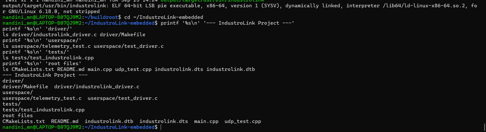
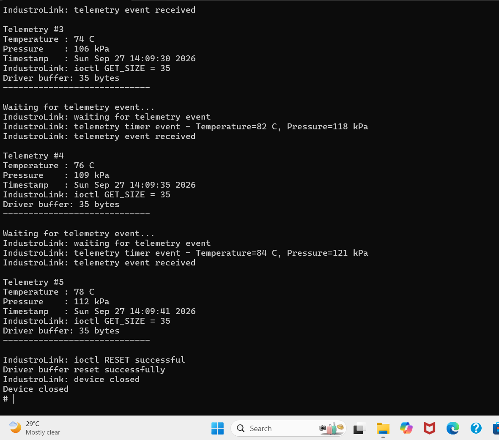
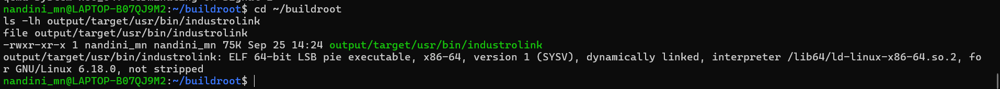
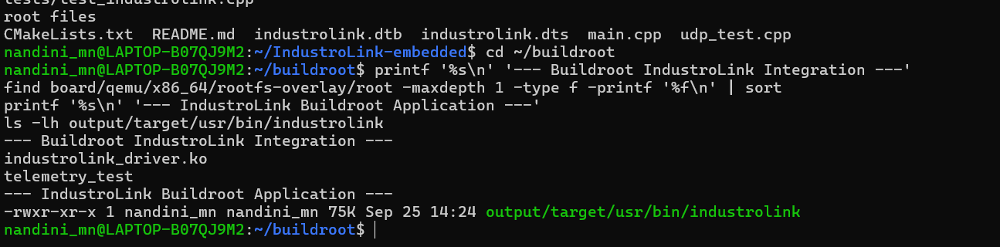

# IndustroLink

## Multi-Threaded TCP/IP Controller-Device Communication Framework

IndustroLink is an embedded/industrial communication framework that simulates controller-to-device communication using TCP/IP and Modbus TCP. The project also includes a Linux character device driver and an Embedded Linux environment built with Buildroot and tested using QEMU.

---

## Architecture

```text
                         IndustroLink
                              |
              +---------------+---------------+
              |                               |
      Communication Layer                Linux Driver
              |                               |
       +------+-------+                 /dev/industrolink
       |              |                       |
    TCP/IP        Modbus TCP             Character Device
       |              |                       |
       +------+-------+              +--------+--------+
              |                      |        |        |
       Device Simulator           read()   write()   ioctl()
              |                      |        |        |
       Sensor/Register              +--------+--------+
          Handling                       |
                                      Wait Queue
                                         |
                                       Mutex
                                         |
                                Userspace Test Program

                         Embedded Linux
                              |
                         Buildroot
                              |
                      Linux Kernel + RootFS
                              |
                             QEMU
                              |
                         Device Tree
```

---

# 1. C++ Communication Framework

The core IndustroLink application implements controller-to-device communication using TCP/IP and Modbus TCP.

### Features

* C++17
* TCP/IP communication
* Controller-device communication
* Modbus TCP protocol
* Modbus function `0x03` read
* Modbus function `0x06` write
* Read-after-write integration testing
* Sensor/register simulation
* Multithreaded communication
* RAII-based socket handling
* CMake build system

---

# 2. Linux Character Device Driver

IndustroLink includes a Linux kernel character device driver for telemetry communication.

### Driver features

* Linux kernel module
* Character device registration
* Dynamic major/minor allocation
* `/dev/industrolink`
* `open()`
* `read()`
* `write()`
* `ioctl()`
* Wait queue based blocking behavior
* Mutex synchronization
* Kernel timer based telemetry generation
* Userspace C test program
* Kernel logging using `printk()` / `dmesg`

### Driver architecture

```text
Userspace Application
        |
        | open()
        | read()
        | write()
        | ioctl()
        v
/dev/industrolink
        |
        v
Linux Character Driver
        |
   +----+----+
   |         |
 Mutex    Wait Queue
   |         |
   +----+----+
        |
        v
Telemetry Buffer
        |
        v
Kernel Timer
```

---

# 3. Userspace Driver Testing

The userspace telemetry test program communicates with the kernel driver through `/dev/industrolink`.

It demonstrates:

```text
open()
   |
   v
ioctl()
   |
   +---- WAIT_EVENT
   |
   +---- GET_SIZE
   |
   +---- RESET
   |
   v
close()
```

The driver implementation also provides:

```text
open()
read()
write()
ioctl()
```

with wait queue and mutex synchronization inside the kernel module.

---

# 4. Embedded Linux Platform

The embedded Linux environment was created using Buildroot and tested using QEMU x86_64.

### Build flow

```text
IndustroLink Source
        |
        v
Buildroot Toolchain
        |
        v
Cross Compilation
        |
        v
Root Filesystem Overlay
        |
        v
Linux Kernel + Root Filesystem
        |
        v
QEMU x86_64
        |
        v
IndustroLink Driver + Applications
```

### Embedded Linux features

* Buildroot
* Linux kernel
* Custom kernel configuration
* QEMU x86_64
* Custom root filesystem overlay
* Device Tree source
* Device Tree validation
* Cross-compiled C/C++ application
* Linux character driver
* Userspace telemetry application

---

# 5. Device Tree

A custom Device Tree source was created for the IndustroLink QEMU environment.

File:

```text
industrolink.dts
```

The Device Tree contains an IndustroLink telemetry node:

```dts
industrolink {
    compatible = "industrolink,telemetry";
    status = "okay";

    telemetry {
        compatible = "industrolink,telemetry-device";
        status = "okay";
    };
};
```

This provides a device-tree representation of the IndustroLink telemetry device.

---

# 6. Buildroot Integration

The IndustroLink driver and applications were integrated into the Buildroot root filesystem using root filesystem overlays.

The generated target filesystem contains the IndustroLink application:

```text
output/target/usr/bin/industrolink
```

The application was verified as an x86-64 Linux ELF executable.

Buildroot successfully generated:

```text
output/images/rootfs.ext2
```

The Buildroot filesystem was booted successfully using QEMU.

---

# 7. QEMU Verification

The Buildroot Linux system successfully booted in QEMU.

The network interface obtained an IP address:

```text
udhcpc: lease of 10.0.2.15 obtained from 10.0.2.2
```

The IndustroLink kernel module was loaded successfully:

```text
IndustroLink: driver loaded
IndustroLink: major=250 minor=0
```

The device node was created:

```text
/dev/industrolink
```

---

# 8. Telemetry Verification

The driver successfully generated telemetry events using the kernel timer.

Example output:

```text
IndustroLink: telemetry timer event - Temperature=70 C, Pressure=100 kPa
IndustroLink: telemetry timer event - Temperature=72 C, Pressure=103 kPa
IndustroLink: telemetry timer event - Temperature=74 C, Pressure=106 kPa
IndustroLink: telemetry timer event - Temperature=76 C, Pressure=109 kPa
IndustroLink: telemetry timer event - Temperature=78 C, Pressure=112 kPa
```

This verifies that the kernel driver was running inside the Buildroot/QEMU environment and generating telemetry data.

---

# 9. Testing and Code Quality

The project includes multiple levels of testing.

### Unit testing

GoogleTest is used for C++ unit tests.

### Integration testing

The project includes Modbus read-after-write integration testing.

### Driver testing

The userspace telemetry test exercises the Linux character device interface.

### Static analysis

The project was checked using:

* cppcheck
* clang-tidy

### Memory debugging

An AddressSanitizer build was also used for C++ testing.

---

# 10. Project Structure

```text
IndustroLink-embedded/
|
├── driver/
│   ├── Makefile
│   └── industrolink_driver.c
|
├── userspace/
│   ├── telemetry_test.c
│   └── test_driver.c
|
├── tests/
│   └── test_industrolink.cpp
|
├── main.cpp
├── udp_test.cpp
├── CMakeLists.txt
├── industrolink.dts
├── .gitignore
└── README.md
```

---

# 11. Technologies Used

* C
* C++17
* Linux Kernel
* Linux Character Device Drivers
* TCP/IP
* Modbus TCP
* POSIX APIs
* CMake
* GoogleTest
* Buildroot
* Device Tree
* QEMU
* Git
* AddressSanitizer
* cppcheck
* clang-tidy

---

# 12. Build Commands

## Native C++ Build

```bash
mkdir -p build
cd build
cmake ..
make
```

## Run Tests

```bash
ctest --output-on-failure
```

## Driver Build

```bash
cd driver
make
```

## Buildroot

The embedded Linux target is built using the Buildroot configuration for QEMU x86_64.

The generated filesystem contains the IndustroLink driver and userspace applications.

---

# 13. Key Learning Outcomes

This project provided hands-on experience with:

* Linux kernel module development
* Character device drivers
* Kernel/userspace communication
* `copy_to_user()` and `copy_from_user()`
* `ioctl()` interfaces
* Wait queues and blocking I/O
* Mutex synchronization
* Kernel timers
* TCP/IP communication
* Modbus TCP
* Multithreaded C++ programming
* Embedded Linux
* Buildroot
* Device Tree
* Cross compilation
* QEMU-based embedded system testing
* Linux debugging and kernel logs
* Automated testing and static analysis

## Verification & Demonstration

### Project Structure



### Linux Character Driver & Telemetry



### Buildroot Application



### Buildroot Integration


---

# Author

**Nandini M N**

Computer Science & Engineering
MITE, Moodabidri
